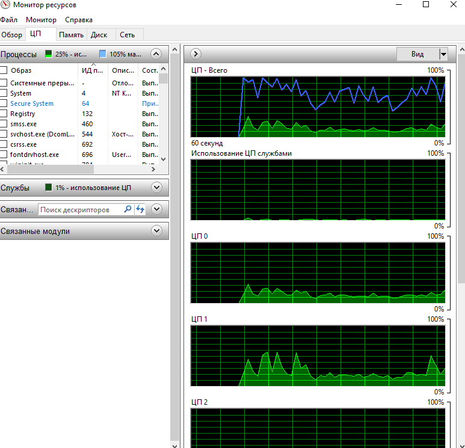

# Task 2: Networking Analysis

## Traceroute Analysis:
To perform a traceroute to a specified website or IP address, you can use the `tracert` command in Windows or the `traceroute` command in Unix-based operating systems. Here's how you can perform a traceroute:

```
tracert www.innopolis.university    // windows
traceroute www.innopolis.university // unix-based
```

### Output:


### Observations:

- The traceroute is performed to the domain `www.innopolis.university` with the corresponding IP address 213.159.212.4.
- The traceroute shows the network path from the source to the destination, with each hop represented by its IP address and round-trip time (RTT) in milliseconds.
- Some hops show a response time in milliseconds (ms), while others display an asterisk (*) or "Request timed out" message. This indicates that those hops did not respond within the specified time limit.
- The first few hops show local IP addresses (e.g., 192.168.0.1, 10.242.1.1), suggesting the local network infrastructure.
- As the traceroute progresses, it reaches various network routers (e.g., 188.130.155.1, 84.18.123.1) belonging to different network providers.
- The traceroute passes through multiple routers (e.g., ae11-498.RT.ITP.KZN.RU.retn.net, ae2-6.rt.ok.msk.ru.retn.net) located in different regions.
- The destination IP address (213.159.212.4) is reached after several hops.

## Dig Analysis:

To perform a DNS lookup for a specified domain name, you can use the `nslookup` command in Windows or the `dig` command in Unix-based operating systems. Here's how you can perform a DNS lookup:

```
nslookup www.innopolis.university    // windows
dig www.innopolis.university    // unix-based
```

### Output:



### Observations:

- The nslookup command provides information about the DNS resolution for the specified domain name.
- The output includes the server used for the DNS lookup and the IP address associated with the domain name.
